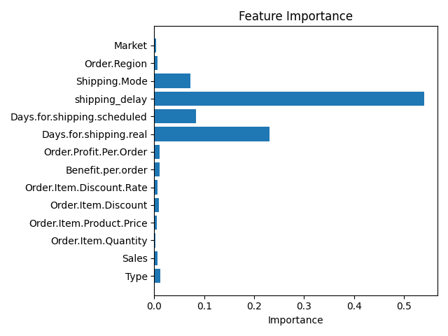

# Supply Chain Delay Prediction

Machine Learning project to predict delivery delays using supply chain data.

## Dataset

Supply chain dataset containing order information, shipping data, and delivery risk.

## Features Used

* Type
* Sales
* Order Item Quantity
* Product Price
* Order Item Discount
* Order Item Discount Rate
* Benefit per Order
* Order Profit Per Order
* Days for Shipping (Real)
* Days for Shipment (Scheduled)
* Shipping Mode
* Order Region
* Market

## Feature Engineering

An additional feature was introduced to improve prediction performance:

```
shipping_delay = Days.for.shipping.real - Days.for.shipment.scheduled
```

This feature captures the difference between actual and scheduled shipping time and significantly improves model performance.

## Model

Random Forest Classifier

Model improvements include:

* increased number of trees
* tuned model depth
* balanced class weights
* additional predictive features

Improved accuracy: **~0.97**

## Feature Importance

Feature importance analysis was performed to understand which variables most influence delivery delay predictions.

See the feature importance plot below:



## Tech Stack

* Python
* Pandas
* Scikit-learn
* Matplotlib
* Flask
