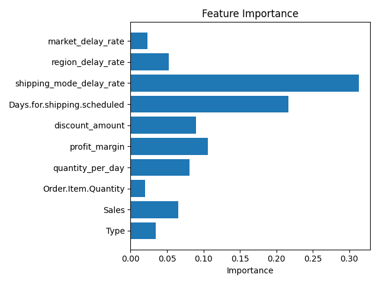

# Supply Chain Delay Prediction

Machine Learning project that predicts whether an order will experience **late delivery** using supply chain transaction data.

The project demonstrates a full machine learning workflow including:

* data preprocessing
* feature engineering
* model training and evaluation
* feature importance analysis
* deployment via a Flask web application

---

# Dataset

The dataset contains supply chain sales records with information about:

* product sales
* shipping modes
* regions and markets
* order quantities
* shipment scheduling
* delivery outcomes

Target variable:

```
Late_delivery_risk
```

Values:

* **0** → On-time delivery
* **1** → Late delivery

---

# Feature Engineering

Several engineered features were introduced to improve predictive performance.

### 1. Quantity per Day

```
quantity_per_day = Order.Item.Quantity - Days.for.shipping.scheduled
```

Captures how shipment scheduling interacts with order volume.

---

### 2. Profit Margin

```
profit_margin = Order.Profit.Per.Order / Sales
```

Measures profitability of an order relative to total sales.

---

### 3. Discount Amount

```
discount_amount = Sales × Order.Item.Discount.Rate
```

Represents the monetary value of applied discounts.

---

### 4. Delay Rate by Shipping Mode

Historical delay probability for each shipping mode.

```
shipping_mode_delay_rate
```

---

### 5. Delay Rate by Region

Average delay probability grouped by geographic region.

```
region_delay_rate
```

---

### 6. Delay Rate by Market

Average delay probability grouped by market.

```
market_delay_rate
```

These engineered features capture **behavioral patterns in the supply chain** that influence delivery delays.

---

# Model

Algorithm used:

```
RandomForestClassifier
```

Key configuration:

* **300 trees**
* **max_depth = 10**
* **min_samples_split = 10**
* random_state = 42

---

# Model Evaluation

The model is evaluated using:

* training accuracy
* testing accuracy
* classification report (precision, recall, F1-score)

Example output:

```
Training Accuracy  ~0.73
Testing Accuracy   ~0.70
```

---

# Feature Importance

Feature importance analysis was performed to identify which variables contribute most to delivery delay prediction.



---

# Web Application

The project includes a **Flask-based web application** that allows users to interact with the model through a simple interface.

Users can input:

* transaction type
* sales amount
* order quantity
* scheduled shipping days
* shipping mode
* order region
* market

The model returns:

```
Late Delivery Expected
or
On Time Delivery
```

---

# Project Structure

```
supply-chain-delay-prediction
│
├── data
│   └── Data_supply.csv
│
├── model
│   ├── train_model.py
│   └── model.pkl
│
├── templates
│   └── index.html
│
├── notebooks
│   └── eda.ipynb
│
├── reports
│   └── feature_importance_v3.png
│
├── app.py
├── requirements.txt
└── README.md
```

---

# Tech Stack

* Python
* Pandas
* Scikit-learn
* Matplotlib
* Flask
* HTML / JavaScript
* Git
